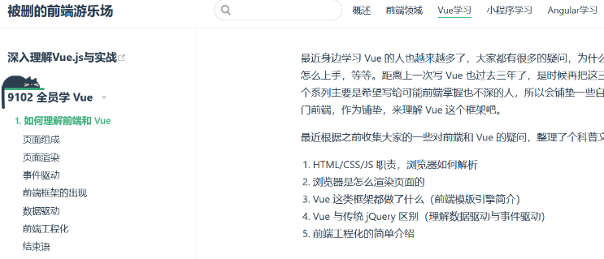
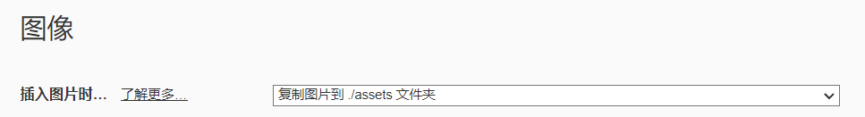

凡事都循规蹈矩，凡是都蹑手蹑脚。

# 好无聊哈哈哈 ( •̀ ω •́ )y

为什么没有珊瑚宫心海爽文可以看，为什么为什么为什么，啊，受不了了！只能干这个复制粘贴的活了。


## Markdown # &&  VuePress sidebar

写报告的时候喜欢随意乱写，一堆 Markdown 组成一个章节（比如整理某个阶段的 review）的时候，目录再乱写直接变成 shit mountain。

注：多篇文章组成的篇章中 Sidebar 的组织参考（借鉴/抄袭/ctrl+c喵）自 [被删的前端游乐场](http://www.godbasin.com/vue/vue-for-everyone/vue-for-everyone-1.html)




#### (1) 借鉴的内容

* **整体样式**：Sidebar 严格使用官方文档中可折叠的样式

  ``` js
  sidebar: {
        '/t-f-my-heart/': [
          {
              text: "谨防新型珊瑚宫心海骗局",
              collapsible: true,
              children: ['/t-f-my-heart/kokomi.md', '/t-f-my-heart/ycte.md']
          },
        ],
        '/': [
          {
            text: '关于我♥',
            children: ['/my-heart.md']
          }
        ]
      },
  ```

* 简化目录内容方便 top-down：Sidebar 的 `sidebarDepth` 设置为 1，仅提取 `h2` 进入 Sidebar

* **放弃用缩进区分不同等级的 sidebar 内容**：每篇文章的 Frontmatter 中将 `title` 设置为 “#.*” （# 代表一个个位数字）的格式，用于区分不同文章

  ```markdown
  ---
  lang: zh-CN
  title: 0.一些维护 markdown 时候的小技巧
  description: 用阿拉伯数字序号加上文章标题区分篇章的不同章节
  ---
  ```


#### (2) 本土化的一些内容

* **层次（大小标题）**：正文只使用 1 次 `h1` , `h2` 不加序号，`h4` 使用 “(#) *” 的格式，序号与标题用英文半角空格隔开，均使用半角符号，一般不使用 `h3`、`h5` ~ `h6`
* “含蓄”留白：在任何标题行统一空一行（除 `h1` 前的介绍会自动空出较大间隙外）区分板块，其他正文区域统一不留空行**（空几行均是 Typora  的默认标准，即软件自带空行外多加一行）**
* 整齐： 逗号、句号等代表结束的标点使用半角与否由句段决定，引号、书名号等限制范围的标点由范围内句段决定，**仅**在重点内容**加粗**
* commit 影响范围：blog、sidebar、navbar、theme、plugin


## Typora && VuePress 静态资源管理

不用最喜欢的工具写出来的 markdown， 不叫做 markdown。在 [VuePress v2.0.0-beta67 manual 的静态资源部分](https://v2.vuepress.vuejs.org/zh/guide/assets)，官方提供了 `相对路径`、`public 文件`、`依赖包。。` 三种方法来管理 blog 图片，而且官方都推荐第一种了，平时写的时候就**只用**第一种就好了，配合 Typora 直接起飞，欸~*。


#### (1) 文章的静态资源

* 官方文档的介绍

  > 一般情况下，我们**推荐**你使用这种方式来引用图片，因为人们通常会把图片放在引用它的 Markdown 文件附近。

* 而 Typora 提供的功能

  

* 无需任何其他设置，写完直接 push，美滋滋


#### (2) 主题、插件和其他 VuePress 功能的静态资源

* 呜呜呜，这就没办法了，使用官方推荐的 public 文件夹防止文件混乱吧

* 使用文件时按照如下相对路径访问，假设 `public` 配置保持默认 ‘.vuepress/public’

  ``` js
  // 访问 ./docs/.vuepress/public/image/kokomi.png
  // 1. Markdown
  // 
  // 2. 主题首页图标
  head: [['link', { rel: 'icon', href: '/images/kokomi.png' }]],
  // 3. 主题左上角小小 icon
  logo: '/image/kokomi.png',
  logoDark: '/image/kokomi.png',
  ```

* 实测部署到 Github 后访问外链图标会出现**跨域问题**，还没研究怎么配置解决，”死于安乐“。但是，极力推荐使用 `public` 和 `相对路径` 管理图片，实用！Typora 一键复制粘贴！


## Updating…


