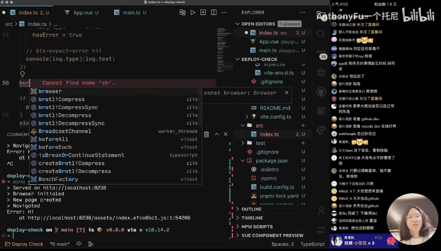
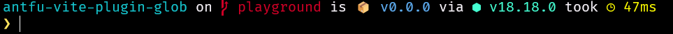

<p align = center>
    
</p>

*注：* 基于主题 `the-unnamed.omp.json` 改造，灵感来自 [@antfu](https://github.com/antfu) 的 b 站[视频](https://www.bilibili.com/video/BV1Hg41127JK?vd_source=59dbff30b0edabbd3b7c7da87ba7daf6)

------

<p align='center'><h1 align='center'>自用 oh-my-posh 主题</h1></p>

## 使用方法（详见[官方文档](https://ohmyposh.dev/docs/installation/fonts))

#### (1) [oh-my-posh](https://ohmyposh.dev/docs/installation/fonts) 和 [Nerd Fonts](https://www.nerdfonts.com/) 安装

1. 安装 oh-my-posh 

   ```shell
   Set-ExecutionPolicy Bypass -Scope Process -Force; Invoke-Expression ((New-Object System.Net.WebClient).DownloadString('https://ohmyposh.dev/install.ps1'))
   ```

2. 安装 Nerd Fonts

   ```
   oh-my-posh font install
   ```

   这里下载比较麻烦，推荐进入 [Nerd Fonts](https://www.nerdfonts.com/) 官网下载字体文件手动安装

#### (2) 默认主题和其他主题使用

1. 默认主题

   管理员打开 PowerShell，输入以下代码：

   ```shell
   notepad $PROFILE # 也可以用超级棒编辑器 VSCode
   ```

   如果显示`找不到文件`，则是没有 PowerShell 配置文件，一般位于`C:Users\{UserName}\Documents\PowerShell`，可以新建一个空白文件，也可以用下面命令生成：

   ```shell
   New-Item -Path $PROFILE -Type File -Force
   ```

   在配置文件末尾加入：

   ```sh
   oh-my-posh init pwsh | Invoke-Expression
   ```

2. 自设主题

   我魔改的主题配置文件`the-unnamed.omp.json`,代码如下：

   ```json
   {
     "$schema": "https://raw.githubusercontent.com/JanDeDobbeleer/oh-my-posh/main/themes/schema.json",
     "blocks": [
       {
         "alignment": "left",
         "segments": [
           {
             "foreground": "#15C2CB",
             "properties": {
               "style": "folder"
             },
             "style": "plain",
             "template": "{{ .Path }} ",
             "type": "path"
           },
           {
             "foreground": "#cf0026",
             "properties": {
               "branch_icon": "\ue0a0 "
             },
             "style": "plain",
             "template": "<#F3EFF5>on</> {{ .HEAD }}{{if .BranchStatus }} {{ .BranchStatus }}{{ end }}{{ if .Working.Changed }} \uf044 {{ .Working.String }}{{ end }}{{ if and (.Working.Changed) (.Staging.Changed) }} |{{ end }}{{ if .Staging.Changed }} \uf046 {{ .Staging.String }}{{ end }} ",
             "type": "git"
           },
           {
             "foreground": "#5EADF2",
             "style": "plain",
             "template": "{{if .Version}}<#F3EFF5>is</> 📦 v{{.Version}} {{end}}",
             "type": "project"
           },
           {
             "foreground": "#44FFD2",
             "properties": {
               "fetch_version": true
             },
             "style": "plain",
             "template": "<#F3EFF5>via</> \ue24f v{{ .Full }} ",
             "type": "node"
           },
           {
             "foreground": "#ffff00",
             "properties": {
               "threshold": 10
             },
             "style": "plain",
             "template": "<#F3EFF5>took</> \ue384 {{ .FormattedMs }} ",
             "type": "executiontime"
           }
         ],
         "type": "prompt"
       },
       {
         "alignment": "left",
         "newline": true,
         "segments": [
           {
             "foreground": "#FFE45E",
             "style": "plain",
             "template": "(●'◡'●) → ",
             "type": "text"
           }
         ],
         "type": "prompt"
       }
     ],
     "version": 2
   }
   ```

   修改 PowerShell 配置文件，末尾加入：

   ```
   oh-my-posh init pwsh --config 'C:\json\the-unnamed.omp.json' | Invoke-Expression
   ```

   也可以自己下载其他主题替换路径
